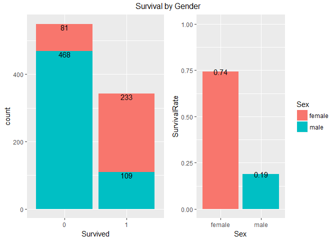
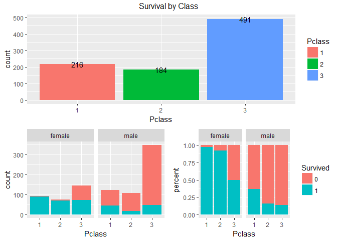
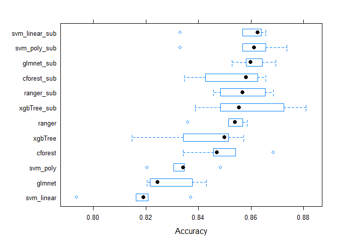
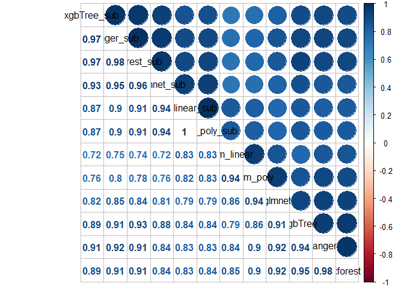

Titanic: Purrr and Caret
================
Bastien Haller

-   [Libraries](#libraries)
-   [Explanatory Data Analysis](#explanatory-data-analysis)
-   [Feature Engineering](#feature-engineering)
-   [Models](#models)
    -   [Fitting Model](#fitting-model)
    -   [Prediction and Ensemble](#prediction-and-ensemble)
    -   [Full tuning paramter List](#full-tuning-paramter-list)

Libraries
=========

``` r
rm(list=ls())
set.seed(1)
library(dplyr)
library(ggplot2)
library(tidyr)
library(stringr)
library(purrr)
library(caret)
library(caretEnsemble)
library(Metrics)
library(readr)
library(gridExtra)
library(knitr)
library(corrplot)
require(DiagrammeR)
library("mxnet")

train<-read_csv("train.csv")
test<-read_csv("test.csv")
train$dset<-"train"
test$dset<-"test"
test$Survived<-NA
combined<-bind_rows(train,test)
```

Explanatory Data Analysis
=========================

``` r
glimpse(train)
```

    ## Observations: 891
    ## Variables: 13
    ## $ PassengerId <int> 1, 2, 3, 4, 5, 6, 7, 8, 9, 10, 11, 12, 13, 14, 15,...
    ## $ Survived    <int> 0, 1, 1, 1, 0, 0, 0, 0, 1, 1, 1, 1, 0, 0, 0, 1, 0,...
    ## $ Pclass      <int> 3, 1, 3, 1, 3, 3, 1, 3, 3, 2, 3, 1, 3, 3, 3, 2, 3,...
    ## $ Name        <chr> "Braund, Mr. Owen Harris", "Cumings, Mrs. John Bra...
    ## $ Sex         <chr> "male", "female", "female", "female", "male", "mal...
    ## $ Age         <dbl> 22, 38, 26, 35, 35, NA, 54, 2, 27, 14, 4, 58, 20, ...
    ## $ SibSp       <int> 1, 1, 0, 1, 0, 0, 0, 3, 0, 1, 1, 0, 0, 1, 0, 0, 4,...
    ## $ Parch       <int> 0, 0, 0, 0, 0, 0, 0, 1, 2, 0, 1, 0, 0, 5, 0, 0, 1,...
    ## $ Ticket      <chr> "A/5 21171", "PC 17599", "STON/O2. 3101282", "1138...
    ## $ Fare        <dbl> 7.2500, 71.2833, 7.9250, 53.1000, 8.0500, 8.4583, ...
    ## $ Cabin       <chr> NA, "C85", NA, "C123", NA, NA, "E46", NA, NA, NA, ...
    ## $ Embarked    <chr> "S", "C", "S", "S", "S", "Q", "S", "S", "S", "C", ...
    ## $ dset        <chr> "train", "train", "train", "train", "train", "trai...

``` r
glimpse(test)
```

    ## Observations: 418
    ## Variables: 13
    ## $ PassengerId <int> 892, 893, 894, 895, 896, 897, 898, 899, 900, 901, ...
    ## $ Pclass      <int> 3, 3, 2, 3, 3, 3, 3, 2, 3, 3, 3, 1, 1, 2, 1, 2, 2,...
    ## $ Name        <chr> "Kelly, Mr. James", "Wilkes, Mrs. James (Ellen Nee...
    ## $ Sex         <chr> "male", "female", "male", "male", "female", "male"...
    ## $ Age         <dbl> 34.5, 47.0, 62.0, 27.0, 22.0, 14.0, 30.0, 26.0, 18...
    ## $ SibSp       <int> 0, 1, 0, 0, 1, 0, 0, 1, 0, 2, 0, 0, 1, 1, 1, 1, 0,...
    ## $ Parch       <int> 0, 0, 0, 0, 1, 0, 0, 1, 0, 0, 0, 0, 0, 0, 0, 0, 0,...
    ## $ Ticket      <chr> "330911", "363272", "240276", "315154", "3101298",...
    ## $ Fare        <dbl> 7.8292, 7.0000, 9.6875, 8.6625, 12.2875, 9.2250, 7...
    ## $ Cabin       <chr> NA, NA, NA, NA, NA, NA, NA, NA, NA, NA, NA, NA, "B...
    ## $ Embarked    <chr> "Q", "S", "Q", "S", "S", "S", "Q", "S", "C", "S", ...
    ## $ dset        <chr> "test", "test", "test", "test", "test", "test", "t...
    ## $ Survived    <lgl> NA, NA, NA, NA, NA, NA, NA, NA, NA, NA, NA, NA, NA...

``` r
combined$Sex<-as.factor(combined$Sex)
combined$Pclass<-as.factor(combined$Pclass)
combined$PassengerId<-as.character(combined$PassengerId)


data.frame(NumberNA=map_dbl(combined[,c(-1,-2,-13)], function(x){sum(is.na(x))}))
```

|          |  NumberNA|
|----------|---------:|
| Pclass   |         0|
| Name     |         0|
| Sex      |         0|
| Age      |       263|
| SibSp    |         0|
| Parch    |         0|
| Ticket   |         0|
| Fare     |         1|
| Cabin    |      1014|
| Embarked |         2|

``` r
p1<-combined%>%filter(dset=="train")%>%
  ggplot(aes(x=as.factor(Survived),fill=Sex))+geom_bar()+
   geom_text(stat="count",aes(label=..count..),position = "stack",vjust=1,size=4)+
  labs(x="Survived")+
  theme(legend.position="none")

p2<-combined%>%filter(dset=="train")%>%
  group_by(Sex)%>%
  summarise(SurvivalRate=mean(Survived))%>%
  ggplot(aes(x=Sex,y=SurvivalRate,fill=Sex))+geom_col()+
  geom_text(aes(label=round(SurvivalRate,2)))+expand_limits(y=1)

  
grid.arrange(p1,p2,nrow=1,top="Survival by Gender")
```



``` r
combined%>%filter(dset=="train")%>%group_by(Sex)%>%summarise(count=n(),SurivalRate=mean(Survived))
```

| Sex    |  count|  SurivalRate|
|:-------|------:|------------:|
| female |    314|    0.7420382|
| male   |    577|    0.1889081|

``` r
p3<-combined%>%
  filter(dset=="train")%>%
    ggplot(aes(x=Pclass,fill=Pclass))+geom_bar(stat="count",position="dodge")+
    geom_text(stat="count",aes(label=..count..))

p4<-combined%>%filter(dset=="train")%>%
  ggplot(aes(x=Pclass,fill=as.factor(Survived)))+geom_bar()+facet_wrap(~Sex)+theme(legend.position = "none")


p5<-combined%>%filter(dset=="train")%>%
  ggplot(aes(x=Pclass,fill=as.factor(Survived)))+geom_bar(position="fill")+facet_wrap(~Sex)+
  labs(fill="Survived",y="percent")

grid.arrange(p3,p4,p5,layout_matrix=rbind(c(1,1),c(2,3)),top="Survival by Class")
```



``` r
combined%>%filter(dset=="train")%>%group_by(Pclass,Sex)%>%summarise(count=n(),SurivalRate=mean(Survived))
```

| Pclass | Sex    |  count|  SurivalRate|
|:-------|:-------|------:|------------:|
| 1      | female |     94|    0.9680851|
| 1      | male   |    122|    0.3688525|
| 2      | female |     76|    0.9210526|
| 2      | male   |    108|    0.1574074|
| 3      | female |    144|    0.5000000|
| 3      | male   |    347|    0.1354467|

Feature Engineering
===================

``` r
combined<-combined%>%mutate(PClassSex=paste("P",Pclass,Sex,sep=""))

combined<-combined%>%mutate(FamilyName=substr(Name,1,str_locate(Name,",")-1),
                  title=substr(Name,str_locate(Name,",")+2,str_locate(Name,"\\.")-1)
                  )

p6<-combined%>%filter(dset=="train")%>%
  group_by(Sex,title)%>%
  summarise(count=n(),SurvivalRate=mean(Survived))%>%
  ggplot(aes(y=SurvivalRate,x=count,col=title))+geom_jitter()+facet_grid(~Sex)+scale_x_log10()+labs(x="# Pax")

combined%>%
  group_by(Sex,title)%>%
  summarise(count=n(),SurvivalRate=mean(Survived,na.rm=TRUE))%>%arrange(count,desc(SurvivalRate))
```

| Sex    | title        |  count|  SurvivalRate|
|:-------|:-------------|------:|-------------:|
| female | Dr           |      1|     1.0000000|
| female | Lady         |      1|     1.0000000|
| female | Mme          |      1|     1.0000000|
| female | the Countess |      1|     1.0000000|
| male   | Sir          |      1|     1.0000000|
| male   | Capt         |      1|     0.0000000|
| male   | Don          |      1|     0.0000000|
| male   | Jonkheer     |      1|     0.0000000|
| female | Dona         |      1|           NaN|
| female | Mlle         |      2|     1.0000000|
| female | Ms           |      2|     1.0000000|
| male   | Major        |      2|     0.5000000|
| male   | Col          |      4|     0.5000000|
| male   | Dr           |      7|     0.3333333|
| male   | Rev          |      8|     0.0000000|
| male   | Master       |     61|     0.5750000|
| female | Mrs          |    197|     0.7920000|
| female | Miss         |    260|     0.6978022|
| male   | Mr           |    757|     0.1566731|

``` r
combined<-combined%>%mutate(title=ifelse(title %in% c("Mlle","Ms"),"Miss",title))
combined<-combined%>%mutate(title=ifelse(title %in% c("Mme"),"Mrs",title))
combined<-combined%>%mutate(title=ifelse(title %in% c("Jonkheer","Rev","Capt"),"Mr",title))
combined<-combined%>%
  mutate(title=ifelse(title %in% c("Dr","Lady","the Countess","Don","Dona","Sir","Major","Col"),"RareTitle",title))

p7<-combined%>%filter(dset=="train")%>%
  group_by(Sex,title)%>%
  summarise(count=n(),SurvivalRate=mean(Survived))%>%
  ggplot(aes(y=SurvivalRate,x=count,col=title))+geom_jitter()+facet_grid(~Sex)+scale_x_log10()+labs(x="# Pax")

grid.arrange(p6,p7,ncol=2,top="Survival by Title")
```


``` r
combined<-combined%>%mutate(fsize=SibSp+Parch+1)

p8<-combined%>%filter(dset=="train")%>%
  ggplot(aes(x=fsize,fill=as.factor(Survived)))+geom_bar(stat="count", position='dodge')+
  labs(fill="Survived")

p9<-combined%>%filter(dset=="train")%>%group_by(fsize)%>%
  summarise(count=n(),SurvivalRate=mean(Survived))%>%
  arrange(desc(SurvivalRate))%>%ggplot(aes(x=fsize,y=SurvivalRate,fill=factor(fsize)))+geom_col()+
  theme(legend.position = "none")+expand_limits(y=1)


grid.arrange(p8,p9,ncol=2,top="Survial by Family size")
```


``` r
combined%>%filter(dset=="train")%>%group_by(fsize)%>%
  summarise(count=n(),SurvivalRate=mean(Survived))%>%
  arrange(desc(SurvivalRate))
```

|  fsize|  count|  SurvivalRate|
|------:|------:|-------------:|
|      4|     29|     0.7241379|
|      3|    102|     0.5784314|
|      2|    161|     0.5527950|
|      7|     12|     0.3333333|
|      1|    537|     0.3035382|
|      5|     15|     0.2000000|
|      6|     22|     0.1363636|
|      8|      6|     0.0000000|
|     11|      7|     0.0000000|

``` r
TicketGroup<-combined%>%group_by(Ticket)%>%summarise(Tsize=n())
combined<-combined%>%left_join(TicketGroup,by="Ticket")

combined%>%filter(dset=="train")%>%count(Embarked)
```

| Embarked |    n|
|:---------|----:|
| C        |  168|
| Q        |   77|
| S        |  644|
| NA       |    2|

``` r
#replace NA by most common value
combined$Embarked[is.na(combined$Embarked)]<-"S"


combined<-combined%>%mutate(FarePP=Fare/Tsize)
#replace missing and 0 fares by respective median of Pclass and Embarked
medianFares<-combined%>%filter(dset=="train")%>%group_by(Pclass,Embarked)%>%
  summarise(medianFare=median(Fare,na.rm=TRUE),medianFarePP=median(FarePP,na.rm=TRUE))


combined<-combined%>%inner_join(medianFares,by=c("Pclass"="Pclass","Embarked"="Embarked"))


combined[is.na(combined$Fare),"Fare"]=combined[is.na(combined$Fare),"medianFare"]


combined[is.na(combined$FarePP)|combined$FarePP==0,"FarePP"]=combined[is.na(combined$FarePP)|combined$FarePP==0,"medianFarePP"]


plotHist=function(x,bins=30){
  
combined%>%filter(dset=="train")%>%ggplot(aes_string(x=x))+geom_histogram(bins=bins,fill="blue")  
  
}

plotCols<-list("Fare","FarePP")
bins=list(30,30)

p10<-map2(plotCols,bins,plotHist)

grid.arrange(p10[[1]],p10[[2]],ncol=2,top="Distribution of Fares")
```


``` r
p11<-combined%>%filter(dset=="train")%>%ggplot(aes(x=Age,fill=factor(Survived)))+geom_histogram()+facet_wrap(~Survived)+
  theme(legend.position = "none")


##replace missing Age values by rf predictions
mycontrol<-trainControl(method = "cv",number=5,verboseIter = FALSE)

ageorig<-combined%>%group_by(title)%>%
  summarise(NAP=sum(is.na(Age)),
            medianAge=median(Age,na.rm=TRUE),
            meanAgeOrig=mean(Age,na.rm=TRUE))

model_Age<-train(Age~Pclass+Sex+SibSp+Parch+Fare+Embarked+title+Tsize,
      data=combined[!is.na(combined$Age),],
      method="ranger",
      tuneGrid=expand.grid(.mtry=5,.splitrule="extratrees"),
      trControl=mycontrol)

combined[is.na(combined$Age),"Age"]<-predict(model_Age,combined[is.na(combined$Age),])

p12<-combined%>%filter(dset=="train")%>%ggplot(aes(x=Age,fill=factor(Survived)))+geom_histogram()+facet_wrap(~Survived)+
  theme(legend.position = "none")


ageest<-combined%>%group_by(title)%>%
  summarise(medianAgeEstimated=median(Age,na.rm=TRUE),
            meanAgeEstimated=mean(Age,na.rm=TRUE))


##compare orig and new estimation
grid.arrange(p11,p12,ncol=2,top="Original vs Estimated Age Distribution")
```


``` r
bind_cols(ageorig,ageest)%>%select(-title1)
```

| title     |  NAP|  medianAge|  meanAgeOrig|  medianAgeEstimated|  meanAgeEstimated|
|:----------|----:|----------:|------------:|-------------------:|-----------------:|
| Master    |    8|        4.0|     5.482641|             6.00000|           5.80458|
| Miss      |   51|       22.0|    21.824366|            22.00000|          21.43406|
| Mr        |  176|       29.0|    32.447547|            29.00000|          32.16965|
| Mrs       |   27|       35.0|    36.918129|            35.12204|          36.75243|
| RareTitle |    1|       48.5|    45.944444|            48.00000|          45.95784|

``` r
combined<-combined%>%mutate(Ischild=ifelse(Age<15,"Yes","No"))


### 
TicketGroup<-combined%>%group_by(Ticket)%>%
  summarise(Tsize=n(),minAge=min(Age),NumNA=sum(is.na(Survived)),SumSurvived=sum(Survived,na.rm=TRUE))%>%ungroup()%>%
  mutate(HasChildren=ifelse(minAge<=15 & Tsize>1,"Yes","No"),
         KnownSurvivor=ifelse(SumSurvived>=1 & Tsize>1,"Yes","No"))
combined<-combined%>%select(-Tsize)%>%left_join(TicketGroup,by="Ticket")


p13<-combined%>%filter(dset=="train")%>%
  ggplot(aes(x=Tsize,fill=as.factor(Survived)))+geom_bar(stat="count", position='dodge')+
  labs(fill="Survived")

p14<-combined%>%filter(dset=="train")%>%group_by(Tsize)%>%
  summarise(count=n(),SurvivalRate=mean(Survived))%>%
  arrange(desc(SurvivalRate))%>%ggplot(aes(x=Tsize,y=SurvivalRate,fill=factor(Tsize)))+geom_col()+
  theme(legend.position = "none")+expand_limits(y=1)

grid.arrange(p13,p14,ncol=2,top="Survival by Ticketsize")
```


``` r
combined%>%filter(dset=="train")%>%group_by(Tsize)%>%
  summarise(count=n(),SurvivalRate=mean(Survived))%>%
  arrange(desc(SurvivalRate))
```

|  Tsize|  count|  SurvivalRate|
|------:|------:|-------------:|
|      4|     44|     0.7272727|
|      3|    101|     0.6534653|
|      2|    181|     0.5138122|
|      8|     13|     0.3846154|
|      5|     21|     0.3333333|
|      1|    481|     0.2702703|
|      6|     19|     0.2105263|
|      7|     24|     0.2083333|
|     11|      7|     0.0000000|

``` r
## creating factors for groups

combined$TsizeCat<-NA
combined$TsizeCat[combined$Tsize==1]<-"solo"
combined$TsizeCat[combined$Tsize==2]<-"couple"
combined$TsizeCat[combined$Tsize>2 & combined$Tsize<5]<-"group"
combined$TsizeCat[combined$Tsize>=5]<-"largeGroup"
combined$TsizeCat<-as.factor(combined$TsizeCat)

combined%>%filter(dset=="train")%>%group_by(TsizeCat)%>%
  summarise(count=n(),SurvivalRate=mean(Survived))%>%
  arrange(desc(SurvivalRate))
```

| TsizeCat   |  count|  SurvivalRate|
|:-----------|------:|-------------:|
| group      |    145|     0.6758621|
| couple     |    181|     0.5138122|
| solo       |    481|     0.2702703|
| largeGroup |     84|     0.2500000|

``` r
combined<-combined%>%mutate(FamilyID=ifelse(fsize>2,
                              paste(as.character(fsize),FamilyName,sep=""),
                              "small"))

fam<-combined%>%dplyr::count(FamilyID)%>%filter(n<=2)

combined$FamilyID[combined$FamilyID %in% fam$FamilyID]<-"small"


##replace NA with U and use first Letter for the Deck
combined$Cabin[is.na(combined$Cabin)]="Unknown"
combined$Cabin<-substr(combined$Cabin,1,1)
combined$Cabin<-as.factor(combined$Cabin)


p15<-combined%>%filter(dset=="train")%>%ggplot(aes(x=Cabin,fill=factor(Survived)))+geom_bar()+facet_grid(~Pclass)+
  labs(fill="Survived")


p16<-combined%>%filter(dset=="train")%>%group_by(Cabin,Pclass)%>%summarise(count=n(),SurvivalRate=mean(Survived))%>%
  ggplot(aes(y=SurvivalRate,x=Cabin))+geom_col()+facet_wrap(~Pclass)

grid.arrange(p15,p16,ncol=2,top="Survial by Cabin")
```


``` r
combined%>%filter(dset=="train")%>%group_by(Pclass,Sex,HasChildren)%>%
  summarise(count=n(),SurvivalRate=mean(Survived))%>%
  ggplot(aes(y=SurvivalRate,x=Pclass,fill=HasChildren))+geom_col(position="dodge")+facet_wrap(~Sex)
```


``` r
combined%>%filter(dset=="train")%>%group_by(Pclass,Sex,KnownSurvivor)%>%
  summarise(count=n(),SurvivalRate=mean(Survived))%>%
  ggplot(aes(y=SurvivalRate,x=Pclass,fill=KnownSurvivor))+geom_col(position="dodge")+facet_wrap(~Sex)
```


Models
======

Fitting Model
-------------

``` r
combined$Embarked<-as.factor(combined$Embarked)
combined$HasChildren<-as.factor(combined$HasChildren)
combined$KnownSurvivor<-as.factor(combined$KnownSurvivor)
combined$title<-as.factor(combined$title)
combined$PClassSex<-as.factor(combined$PClassSex)
combined$Survived<-as.factor(combined$Survived)
combined$Ticket<-as.factor(combined$Ticket)
combined$Ischild<-as.factor(combined$Ischild)
combined$FamilyID<-as.factor(combined$FamilyID)


train<-combined%>%filter(dset=="train")
test<-combined%>%filter(dset=="test")%>%mutate(Survived=1)

trainY<-train$Survived
levels(trainY)=c("N","Y")
myFolds<-createFolds(trainY,k=5)

## 5 Fold cross validation, twoclassSummary for AUC
myControl<-trainControl(
  summaryFunction = defaultSummary,
  classProbs = TRUE,
  savePredictions = TRUE,
  verboseIter = FALSE,
  index = myFolds,
  method = "cv"
)

names(getModelInfo())[1:5]
```

    ## [1] "ada"         "AdaBag"      "AdaBoost.M1" "adaboost"    "amdai"

``` r
full=Survived ~ Pclass+Sex+Embarked+title+fsize+Fare+Age+KnownSurvivor+Parch+SibSp+FamilyID
sub=Survived~Pclass+Sex+TsizeCat+Age+KnownSurvivor+FarePP+title

##glmnet without title???
trainX<-model.matrix(full,data=train)[,-1]
trainX_subset<-model.matrix(sub,data=train)[,-1]
testX<-model.matrix(full,data=test)[,-1]
testX_subset<-model.matrix(sub,data=test)[,-1]


xgb_grid <- expand.grid(
  nrounds = c(10,300,350,400,500,600),
  eta = 0.01,
  max_depth =c(1,2,3,5,6,8),
  gamma = c(0,0.5,1,5,10),
  colsample_bytree=c(0.6,0.9),
  min_child_weight=c( 1, 1.5,2),
  subsample=c(0.6,0.8)
)

modelLookup(model='svmPoly')
```

| model   | parameter | label             | forReg | forClass | probModel |
|:--------|:----------|:------------------|:-------|:---------|:----------|
| svmPoly | degree    | Polynomial Degree | TRUE   | TRUE     | TRUE      |
| svmPoly | scale     | Scale             | TRUE   | TRUE     | TRUE      |
| svmPoly | C         | Cost              | TRUE   | TRUE     | TRUE      |

``` r
#models[["mxnetAdam"]][["finalModel"]][["tuneValue"]]
#models[["svm_poly_sub"]][["bestTune"]]

params_list<-list(
  glmnet=list(method="glmnet",x=trainX,tuneGrid=expand.grid(alpha=1,lambda=0.03030304)),
  glmnet_sub=list(method="glmnet",x=trainX_subset,tuneGrid=expand.grid(alpha=1,lambda=1e-08)),
  ranger=list(method="ranger",x=trainX,importance="impurity",num.trees = 1000,
            tuneGrid=expand.grid(.mtry=18,.splitrule = c("gini"))),
  ranger_sub=list(method="ranger",x=trainX_subset,importance="impurity",num.trees = 1000,
                  tuneGrid=expand.grid(.mtry=6,.splitrule = c("extratrees"))),
  svm_linear=list(method="svmLinear",x=trainX,tuneGrid=expand.grid(C=1.000031),preProcess= c('center', 'scale')),
  svm_linear_sub=list(method="svmLinear",x=trainX_subset,tuneGrid=expand.grid(C=10.00003)),
  svm_poly=list(method="svmPoly",x=trainX,tuneGrid=expand.grid(C=2,degree=1,scale=0.1)),
  svm_poly_sub=list(method="svmPoly",x=trainX_subset,tuneGrid=expand.grid(C=4,degree=1,scale=0.1)),
  #mxnetAdam=list(method="mxnetAdam",x=trainX,tuneLength=5),
  #mxnetAdam_sub=list(method="mxnetAdam",x=trainX_subset,tuneLength=5),
  xgbTree=list(method="xgbTree",x=trainX,tuneGrid=expand.grid(
  nrounds = c(10),
  eta = 0.01,
  max_depth =c(3),
  gamma = c(0),
  colsample_bytree=c(0.9),
  min_child_weight=c( 1),
  subsample=c(0.6)
)),
  xgbTree_sub=list(method="xgbTree",x=trainX_subset,tuneGrid=
expand.grid(
  nrounds = c(300),
  eta = 0.01,
  max_depth =c(8),
  gamma = c(0),
  colsample_bytree=c(0.9),
  min_child_weight=c( 1.5),
  subsample=c(0.9)
)),
  cforest=list(method="cforest",x=trainX,tuneGrid=expand.grid(mtry=48)),
  cforest_sub=list(method="cforest",x=trainX_subset,tuneGrid=expand.grid(mtry=10))
)

#,preProcess= c('center', 'scale')
models<-invoke_map(caret::train,params_list,y=trainY,trControl=myControl,metric="Accuracy")
names(models)=names(params_list)
#plot(models[["xgbTree"]])
#plot(models[["xgbTree_sub"]])
#plot(varImp(models[["xgbTree_sub"]]))
#models[["mxnetAdam_sub"]][["finalModel"]][["tuneValue"]]


resamples<-resamples(models)
summary(resamples)
```

    ## 
    ## Call:
    ## summary.resamples(object = resamples)
    ## 
    ## Models: glmnet, glmnet_sub, ranger, ranger_sub, svm_linear, svm_linear_sub, svm_poly, svm_poly_sub, xgbTree, xgbTree_sub, cforest, cforest_sub 
    ## Number of resamples: 5 
    ## 
    ## Accuracy 
    ##                     Min.   1st Qu.    Median      Mean   3rd Qu.      Max.
    ## glmnet         0.8204769 0.8216292 0.8244382 0.8293993 0.8375350 0.8429173
    ## glmnet_sub     0.8527349 0.8581461 0.8597475 0.8608312 0.8641457 0.8693820
    ## ranger         0.8359046 0.8513324 0.8539326 0.8512909 0.8567416 0.8585434
    ## ranger_sub     0.8457223 0.8483146 0.8567416 0.8568967 0.8653576 0.8683473
    ## svm_linear     0.7935393 0.8162693 0.8190743 0.8173380 0.8207283 0.8370787
    ## svm_linear_sub 0.8330996 0.8567416 0.8625526 0.8563408 0.8637640 0.8655462
    ## svm_poly       0.8204769 0.8305322 0.8342697 0.8336191 0.8345021 0.8483146
    ## svm_poly_sub   0.8330996 0.8567416 0.8611501 0.8580266 0.8655462 0.8735955
    ## xgbTree        0.8146067 0.8342697 0.8499299 0.8414563 0.8513324 0.8571429
    ## xgbTree_sub    0.8387097 0.8483146 0.8553371 0.8591368 0.8723703 0.8809524
    ## cforest        0.8342697 0.8457223 0.8469101 0.8498774 0.8541374 0.8683473
    ## cforest_sub    0.8345021 0.8426966 0.8581461 0.8526887 0.8625526 0.8655462
    ##                NA's
    ## glmnet            0
    ## glmnet_sub        0
    ## ranger            0
    ## ranger_sub        0
    ## svm_linear        0
    ## svm_linear_sub    0
    ## svm_poly          0
    ## svm_poly_sub      0
    ## xgbTree           0
    ## xgbTree_sub       0
    ## cforest           0
    ## cforest_sub       0
    ## 
    ## Kappa 
    ##                     Min.   1st Qu.    Median      Mean   3rd Qu.      Max.
    ## glmnet         0.6122803 0.6178421 0.6216754 0.6342991 0.6507321 0.6689660
    ## glmnet_sub     0.6873029 0.6964099 0.7015762 0.7021838 0.7040029 0.7216271
    ## ranger         0.6486605 0.6758054 0.6765222 0.6758760 0.6865954 0.6917968
    ## ranger_sub     0.6618618 0.6712798 0.6905851 0.6884963 0.7062091 0.7125456
    ## svm_linear     0.5305031 0.6088199 0.6156770 0.6047877 0.6198293 0.6491091
    ## svm_linear_sub 0.6587790 0.6905851 0.7005126 0.6932701 0.7060115 0.7104623
    ## svm_poly       0.6169595 0.6354222 0.6450618 0.6449451 0.6512320 0.6760500
    ## svm_poly_sub   0.6587790 0.6905851 0.6993701 0.6961916 0.7060115 0.7262123
    ## xgbTree        0.5774671 0.6425551 0.6750768 0.6517635 0.6801364 0.6835821
    ## xgbTree_sub    0.6537037 0.6681598 0.6851019 0.6937851 0.7217078 0.7402525
    ## cforest        0.6217165 0.6534181 0.6555586 0.6650161 0.6830732 0.7113141
    ## cforest_sub    0.6342191 0.6425543 0.6903335 0.6754731 0.7009356 0.7093228
    ##                NA's
    ## glmnet            0
    ## glmnet_sub        0
    ## ranger            0
    ## ranger_sub        0
    ## svm_linear        0
    ## svm_linear_sub    0
    ## svm_poly          0
    ## svm_poly_sub      0
    ## xgbTree           0
    ## xgbTree_sub       0
    ## cforest           0
    ## cforest_sub       0

``` r
bwplot(resamples,metric="Accuracy")
```



Prediction and Ensemble
-----------------------

``` r
dataset<-rep(list(testX,testX_subset),length(models)/2)
test_pred<-pmap(list(object=models,newdata=dataset),predict,type="prob")
pred_df<-bind_cols(test_pred)%>%select(contains("y"))
colnames(pred_df)<-names(models)

#cor(pred_df)
corrplot.mixed(cor(pred_df), order="hclust", tl.col="black")
```



``` r
pred_df$ensemble_avg<-(pred_df$svm_linear+pred_df$cforest+pred_df$svm_poly+pred_df$xgbTree)/4

##voting


ensemble_models<-caretList(y=trainY,x=trainX,trControl=myControl,
                           tuneList = list(
                          svmLinear=caretModelSpec(method="svmLinear",tuneGrid=expand.grid(C=1.000031)),
                          cforest=caretModelSpec(method="cforest",tuneGrid=expand.grid(mtry=48))
                           ))

stack <- caretStack(ensemble_models,method="glm",trControl=myControl)

pred_df$ensemble_stacked<-predict(stack,newdata=testX, type="prob")


#test_pred%>%names(.)%>%
#    walk(~write.csv(data.frame(PassengerId=test$PassengerId,Survived=ifelse(test_pred[[.]]["Y"]>0.5,1,0)),
#                   paste0(.,".csv"),row.names=FALSE)
#        )

pred_df%>%names(.)%>%
    walk(~write.csv(data.frame(PassengerId=test$PassengerId,Survived=ifelse(pred_df[,.]>0.5,1,0)),
                   paste0(.,".csv"),row.names=FALSE)
        )

saveRDS(models,"models.rds")
```

Full tuning paramter List
-------------------------

``` r
params_list<-list(
  glmnet=list(method="glmnet",x=trainX,tuneGrid=expand.grid(alpha=0:1,lambda=seq(1e-08, 1, length = 100))),
  glmnet_sub=list(method="glmnet",x=trainX_subset,tuneGrid=expand.grid(alpha=0:1,lambda=seq(1e-08, 1, length = 100))),
  ranger=list(method="ranger",x=trainX,importance="impurity",num.trees = 1000,
            tuneGrid=expand.grid(.mtry=seq(1,ncol(trainX),1),.splitrule = c("gini","extratrees"))),
  ranger_sub=list(method="ranger",x=trainX_subset,importance="impurity",num.trees = 1000,
                  tuneGrid=expand.grid(.mtry=seq(1,ncol(trainX_subset),1),.splitrule = c("gini","extratrees"))),
  svm_linear=list(method="svmLinear",x=trainX,tuneLength=30),
  svm_linear_sub=list(method="svmLinear",x=trainX_subset,tuneLength=30),
  svm_poly=list(method="svmPoly",x=trainX,tuneLength=5),
  svm_poly_sub=list(method="svmPoly",x=trainX_subset,tuneLength=5),
  mxnetAdam=list(method="mxnetAdam",x=trainX,tuneLength=15),
  mxnetAdam_sub=list(method="mxnetAdam",x=trainX_subset,tuneLength=15),
  xgbTree=list(method="xgbTree",x=trainX,tuneGrid=xgb_grid),
  xgbTree_sub=list(method="xgbTree",x=trainX_subset,tuneGrid=xgb_grid),
  cforest=list(method="cforest",x=trainX,tuneLength=15),
  cforest_sub=list(method="cforest",x=trainX_subset,tuneLength=15)
)
```
