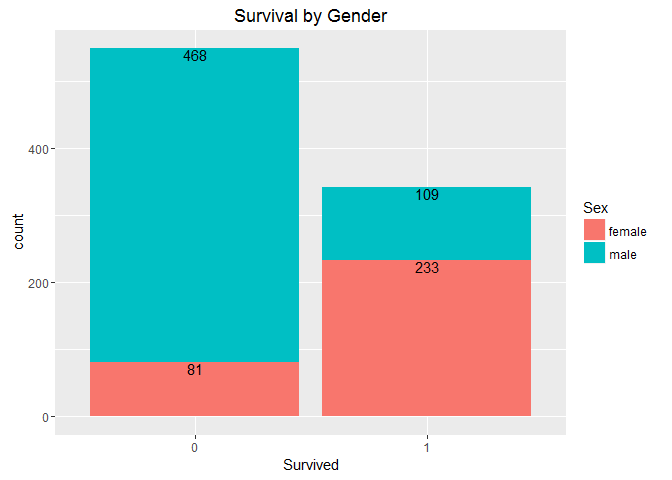

Titanic: Machine Learning from Disaster
================
Bastien Haller

1.1 Libraries
=============

1.2 Explanatory Analysis
========================

``` r
train<-read.csv("train.csv",stringsAsFactors = F)
test<-read.csv("test.csv",stringsAsFactors=F)
test$Survived <- NA
train$dset<-"train"
test$dset<-"test"
combined<-bind_rows(train,test)
str(train)
```

    ## 'data.frame':    891 obs. of  13 variables:
    ##  $ PassengerId: int  1 2 3 4 5 6 7 8 9 10 ...
    ##  $ Survived   : int  0 1 1 1 0 0 0 0 1 1 ...
    ##  $ Pclass     : int  3 1 3 1 3 3 1 3 3 2 ...
    ##  $ Name       : chr  "Braund, Mr. Owen Harris" "Cumings, Mrs. John Bradley (Florence Briggs Thayer)" "Heikkinen, Miss. Laina" "Futrelle, Mrs. Jacques Heath (Lily May Peel)" ...
    ##  $ Sex        : chr  "male" "female" "female" "female" ...
    ##  $ Age        : num  22 38 26 35 35 NA 54 2 27 14 ...
    ##  $ SibSp      : int  1 1 0 1 0 0 0 3 0 1 ...
    ##  $ Parch      : int  0 0 0 0 0 0 0 1 2 0 ...
    ##  $ Ticket     : chr  "A/5 21171" "PC 17599" "STON/O2. 3101282" "113803" ...
    ##  $ Fare       : num  7.25 71.28 7.92 53.1 8.05 ...
    ##  $ Cabin      : chr  "" "C85" "" "C123" ...
    ##  $ Embarked   : chr  "S" "C" "S" "S" ...
    ##  $ dset       : chr  "train" "train" "train" "train" ...

``` r
summary(train)
```

    ##   PassengerId       Survived          Pclass          Name          
    ##  Min.   :  1.0   Min.   :0.0000   Min.   :1.000   Length:891        
    ##  1st Qu.:223.5   1st Qu.:0.0000   1st Qu.:2.000   Class :character  
    ##  Median :446.0   Median :0.0000   Median :3.000   Mode  :character  
    ##  Mean   :446.0   Mean   :0.3838   Mean   :2.309                     
    ##  3rd Qu.:668.5   3rd Qu.:1.0000   3rd Qu.:3.000                     
    ##  Max.   :891.0   Max.   :1.0000   Max.   :3.000                     
    ##                                                                     
    ##      Sex                 Age            SibSp           Parch       
    ##  Length:891         Min.   : 0.42   Min.   :0.000   Min.   :0.0000  
    ##  Class :character   1st Qu.:20.12   1st Qu.:0.000   1st Qu.:0.0000  
    ##  Mode  :character   Median :28.00   Median :0.000   Median :0.0000  
    ##                     Mean   :29.70   Mean   :0.523   Mean   :0.3816  
    ##                     3rd Qu.:38.00   3rd Qu.:1.000   3rd Qu.:0.0000  
    ##                     Max.   :80.00   Max.   :8.000   Max.   :6.0000  
    ##                     NA's   :177                                     
    ##     Ticket               Fare           Cabin             Embarked        
    ##  Length:891         Min.   :  0.00   Length:891         Length:891        
    ##  Class :character   1st Qu.:  7.91   Class :character   Class :character  
    ##  Mode  :character   Median : 14.45   Mode  :character   Mode  :character  
    ##                     Mean   : 32.20                                        
    ##                     3rd Qu.: 31.00                                        
    ##                     Max.   :512.33                                        
    ##                                                                           
    ##      dset          
    ##  Length:891        
    ##  Class :character  
    ##  Mode  :character  
    ##                    
    ##                    
    ##                    
    ## 

``` r
str(test)
```

    ## 'data.frame':    418 obs. of  13 variables:
    ##  $ PassengerId: int  892 893 894 895 896 897 898 899 900 901 ...
    ##  $ Pclass     : int  3 3 2 3 3 3 3 2 3 3 ...
    ##  $ Name       : chr  "Kelly, Mr. James" "Wilkes, Mrs. James (Ellen Needs)" "Myles, Mr. Thomas Francis" "Wirz, Mr. Albert" ...
    ##  $ Sex        : chr  "male" "female" "male" "male" ...
    ##  $ Age        : num  34.5 47 62 27 22 14 30 26 18 21 ...
    ##  $ SibSp      : int  0 1 0 0 1 0 0 1 0 2 ...
    ##  $ Parch      : int  0 0 0 0 1 0 0 1 0 0 ...
    ##  $ Ticket     : chr  "330911" "363272" "240276" "315154" ...
    ##  $ Fare       : num  7.83 7 9.69 8.66 12.29 ...
    ##  $ Cabin      : chr  "" "" "" "" ...
    ##  $ Embarked   : chr  "Q" "S" "Q" "S" ...
    ##  $ Survived   : logi  NA NA NA NA NA NA ...
    ##  $ dset       : chr  "test" "test" "test" "test" ...

``` r
summary(test)
```

    ##   PassengerId         Pclass          Name               Sex           
    ##  Min.   : 892.0   Min.   :1.000   Length:418         Length:418        
    ##  1st Qu.: 996.2   1st Qu.:1.000   Class :character   Class :character  
    ##  Median :1100.5   Median :3.000   Mode  :character   Mode  :character  
    ##  Mean   :1100.5   Mean   :2.266                                        
    ##  3rd Qu.:1204.8   3rd Qu.:3.000                                        
    ##  Max.   :1309.0   Max.   :3.000                                        
    ##                                                                        
    ##       Age            SibSp            Parch           Ticket         
    ##  Min.   : 0.17   Min.   :0.0000   Min.   :0.0000   Length:418        
    ##  1st Qu.:21.00   1st Qu.:0.0000   1st Qu.:0.0000   Class :character  
    ##  Median :27.00   Median :0.0000   Median :0.0000   Mode  :character  
    ##  Mean   :30.27   Mean   :0.4474   Mean   :0.3923                     
    ##  3rd Qu.:39.00   3rd Qu.:1.0000   3rd Qu.:0.0000                     
    ##  Max.   :76.00   Max.   :8.0000   Max.   :9.0000                     
    ##  NA's   :86                                                          
    ##       Fare            Cabin             Embarked         Survived      
    ##  Min.   :  0.000   Length:418         Length:418         Mode:logical  
    ##  1st Qu.:  7.896   Class :character   Class :character   NA's:418      
    ##  Median : 14.454   Mode  :character   Mode  :character                 
    ##  Mean   : 35.627                                                       
    ##  3rd Qu.: 31.500                                                       
    ##  Max.   :512.329                                                       
    ##  NA's   :1                                                             
    ##      dset          
    ##  Length:418        
    ##  Class :character  
    ##  Mode  :character  
    ##                    
    ##                    
    ##                    
    ## 

``` r
combined<-combined%>%
  mutate(familyname=substr(Name,1,str_locate(Name,",")-1),
         title=substr(Name,str_locate(Name,",")+2,str_locate(Name,fixed("."))-1)
  )


combined%>%filter(dset=="train")%>%
  ggplot(aes(x=as.factor(Survived),fill=Sex))+geom_bar()+ggtitle("Survival by Gender")+xlab("Survived")+
   geom_text(stat="count",aes(label=..count..),position = "stack",vjust=1)
```



``` r
combined%>%filter(dset=="train")%>%
  dplyr::count(Survived,Sex)%>%
  mutate(Share=n/sum(n))%>%
  arrange(Survived,-Share)
```

    ## Source: local data frame [4 x 4]
    ## Groups: Survived [2]
    ## 
    ##   Survived    Sex     n     Share
    ##      (int)  (chr) (int)     (dbl)
    ## 1        0   male   468 0.8524590
    ## 2        0 female    81 0.1475410
    ## 3        1 female   233 0.6812865
    ## 4        1   male   109 0.3187135

``` r
combined%>%filter(dset=="train")%>%
  ggplot(aes(x=as.factor(Survived),fill=as.factor(title)))+geom_bar()+facet_wrap(~Sex)+
  ggtitle("Survived by Title")+xlab("Survived")+labs(fill="Title")+ylab("# of pax")
```


``` r
combined%>%filter(dset=="train")%>%
  dplyr::count(title,Sex,Survived)%>%
  ggplot(aes(x=as.factor(Survived),y=n,col=as.factor(title)))+geom_jitter()+facet_wrap(~Sex)+
  ggtitle("Survived by Title")+xlab("Survived")+labs(fill="Title")+ylab("# of pax")+
  guides(col=guide_legend(title="Title"))
```


``` r
combined%>%
  filter(dset=="train")%>%
  group_by(Sex,title)%>%
summarise(SurvivalRate=mean(Survived),count=n())%>%
  ggplot(aes(y=SurvivalRate,x=title,size=count,col=as.factor(Sex)))+geom_point()+
  ggtitle("Survival Rate by Title")+labs(col="sex",size="# of pax")
```


``` r
##cluster titles

combined<-combined%>%mutate(title=ifelse(title %in% c("Mlle","Ms","Dona"),"Miss",title))
combined<-combined%>%mutate(title=ifelse(title %in% c("Mme"),"Mrs",title))
combined<-combined%>%mutate(title=ifelse(title %in% c("Jonkheer","Rev","Don","Capt"),"Mr",title))
combined<-combined%>%mutate(title=ifelse(title 
  %in% c("Dr","Lady","the Countess","Col","Dr","Major","Sir"),"raretitle",title))


combined%>%filter(dset=="train")%>%
  ggplot(aes(x=as.factor(title),fill=as.factor(Survived)))+geom_bar()+facet_wrap(~Sex)+
  ggtitle("Survived by Title")+xlab("Survived")+labs(fill="Survived")+ylab("# of pax")
```


``` r
combined%>%
  filter(dset=="train")%>%
  group_by(Sex,title)%>%
summarise(SurvivalRate=mean(Survived),count=n())%>%
  ggplot(aes(y=SurvivalRate,x=title,size=count,col=as.factor(Sex)))+geom_point()+
  ggtitle("Survival Rate by Title")+labs(col="sex",size="# of pax")
```


``` r
groupsize=combined%>%
  group_by(Ticket)%>%
  summarise(Groupsize=n())
  


combined<-combined%>%left_join(groupsize,by=c("Ticket"="Ticket"))

combined<-combined%>%mutate(familysize=SibSp+Parch+1,
                            familyID=paste(familyname,as.character(familysize)))


Traveltype<-combined%>%
  distinct(Ticket,familyname)%>%
  count(Ticket,familyname)%>%
  group_by(Ticket)%>%summarise(names=sum(n))%>%
  mutate(traveltype=ifelse(names>1,"group","family"))%>%
  dplyr::select(Ticket,traveltype)

combined<-combined%>%left_join(Traveltype,by=c("Ticket"="Ticket"))%>%
  mutate(traveltype=ifelse( Groupsize==1,"single",traveltype))

rm(groupsize,Traveltype)


combined%>%filter(dset=="train")%>%ggplot(aes(x=as.factor(Pclass),fill=as.factor(Survived)))+geom_bar()+facet_wrap(~Sex)+
  ggtitle("Survival by class")+
  labs(x="Pclass",fill="Survived")
```


``` r
combined%>%filter(dset=="train")%>%
  group_by(Sex,Pclass)%>%
  summarise(SurvivalRate=mean(Survived))
```

    ## Source: local data frame [6 x 3]
    ## Groups: Sex [?]
    ## 
    ##      Sex Pclass SurvivalRate
    ##    (chr)  (int)        (dbl)
    ## 1 female      1    0.9680851
    ## 2 female      2    0.9210526
    ## 3 female      3    0.5000000
    ## 4   male      1    0.3688525
    ## 5   male      2    0.1574074
    ## 6   male      3    0.1354467

``` r
combined%>%filter(dset=="train")%>%ggplot(aes(x=Age,y=Pclass,color=as.factor(Survived)))+
  geom_jitter()+
  scale_color_manual(values=c("red", "blue"))+
  facet_grid(Sex~.)+ggtitle("Survival by Class and Age")+labs(col="Survived")
```


``` r
combined%>%filter(dset=="train")%>%ggplot(aes(x=Fare,y=Pclass,color=as.factor(Survived)))+
  geom_jitter()+
  scale_color_manual(values=c("red", "blue"))+
  facet_grid(Sex~.)+ggtitle("Survival by Class and Fare")+labs(col="Survived")
```


``` r
combined%>%filter(dset=="train")%>%
  ggplot(aes(x=Groupsize,fill=factor(Survived)))+
  geom_bar(stat="count",position = "dodge")+
  scale_x_continuous(breaks=c(1:11))+ggtitle("Survival by Group Size")+labs(fill="Survived")
```


``` r
combined%>%filter(dset=="train")%>%
  group_by(Groupsize)%>%
  summarise(SurvivalRate=mean(Survived))%>%
  arrange(desc(SurvivalRate))
```

    ## Source: local data frame [9 x 2]
    ## 
    ##   Groupsize SurvivalRate
    ##       (int)        (dbl)
    ## 1         4    0.7272727
    ## 2         3    0.6534653
    ## 3         2    0.5138122
    ## 4         8    0.3846154
    ## 5         5    0.3333333
    ## 6         1    0.2702703
    ## 7         6    0.2105263
    ## 8         7    0.2083333
    ## 9        11    0.0000000

``` r
combined%>%filter(dset=="train")%>%
  ggplot(aes(x=familysize,fill=factor(Survived)))+
  geom_bar(stat="count",position = "dodge")+
  scale_x_continuous(breaks=c(1:11))+ggtitle("Survival by Family Size")+labs(fill="Survived")
```


``` r
combined%>%filter(dset=="train")%>%
  group_by(familysize)%>%
  summarise(SurvivalRate=mean(Survived))%>%
  arrange(desc(SurvivalRate))
```

    ## Source: local data frame [9 x 2]
    ## 
    ##   familysize SurvivalRate
    ##        (dbl)        (dbl)
    ## 1          4    0.7241379
    ## 2          3    0.5784314
    ## 3          2    0.5527950
    ## 4          7    0.3333333
    ## 5          1    0.3035382
    ## 6          5    0.2000000
    ## 7          6    0.1363636
    ## 8          8    0.0000000
    ## 9         11    0.0000000

``` r
combined<-combined%>%mutate(familysizeD=ifelse(familysize==1,"singleton",
                                               ifelse(familysize>1 &familysize<5,"small","large"))
                              )


combined%>%filter(dset=="train")%>%
  ggplot(aes(x=familysizeD,fill=factor(Survived)))+
  geom_bar(stat="count",position = "dodge")+
 ggtitle("Survival by Family Size")+labs(fill="Survived")
```


``` r
combined%>%filter(dset=="train")%>%
  group_by(familysizeD)%>%
  summarise(SurvivalRate=mean(Survived))%>%
  arrange(desc(SurvivalRate))
```

    ## Source: local data frame [3 x 2]
    ## 
    ##   familysizeD SurvivalRate
    ##         (chr)        (dbl)
    ## 1       small    0.5787671
    ## 2   singleton    0.3035382
    ## 3       large    0.1612903

``` r
combined%>%filter(dset=="train")%>%
  ggplot(aes(x=traveltype,fill=factor(Survived)))+
  geom_bar(stat="count",position = "dodge")+
  ggtitle("Survival by Travel type")+labs(fill="Survived")
```


``` r
combined%>%filter(dset=="train")%>%
  group_by(traveltype)%>%
  summarise(SurvivalRate=mean(Survived))
```

    ## Source: local data frame [3 x 2]
    ## 
    ##   traveltype SurvivalRate
    ##        (chr)        (dbl)
    ## 1     family    0.5093633
    ## 2      group    0.5314685
    ## 3     single    0.2702703

``` r
combined$Deck<-substr(combined$Cabin,1,1)


combined%>%filter(dset=="train")%>%
  ggplot(aes(x=Deck,fill=factor(Survived)))+
  geom_bar(stat="count",position="dodge")+
  ggtitle("Survival by Deck")+labs(fill="Survived")
```


``` r
combined%>%filter(dset=="train")%>%
  group_by(Deck)%>%
  summarise(SurvivalRate=mean(Survived))%>%
  arrange(desc(SurvivalRate))
```

    ## Source: local data frame [9 x 2]
    ## 
    ##    Deck SurvivalRate
    ##   (chr)        (dbl)
    ## 1     D    0.7575758
    ## 2     E    0.7500000
    ## 3     B    0.7446809
    ## 4     F    0.6153846
    ## 5     C    0.5932203
    ## 6     G    0.5000000
    ## 7     A    0.4666667
    ## 8          0.2998544
    ## 9     T    0.0000000

1.3 replace missing values
==========================

``` r
combined$Fare[is.na(combined$Fare)]=median(combined$Fare,na.rm=T)

combined$Embarked[combined$Embarked == ""]="S"


factor_vars<-c("PassengerId","Pclass","Sex","Ticket","Cabin","Embarked","title","traveltype","Deck")


combined[factor_vars]<-lapply(combined[factor_vars],function(x) as.factor(x))


dmy<-dummyVars(Age~Pclass+Sex+SibSp+Parch+Fare+Embarked+title+familysize,data=combined,fullRank = TRUE)
age_transformed<-data.frame(predict(dmy, newdata = combined))


 trControl = trainControl(method = "cv", number = 10, verboseIter = FALSE)
 

 capture.output(model<-train(x=age_transformed[!is.na(combined$Age),],
                  y=combined$Age[!is.na(combined$Age)],
                            method = "ranger",
                          num.trees = 1000,
                          tuneGrid=data.frame(mtry=4),
                                   trControl=trControl
                            ))
```

    ## character(0)

``` r
 print(model)
```

    ## Random Forest 
    ## 
    ## 1046 samples
    ##   13 predictor
    ## 
    ## No pre-processing
    ## Resampling: Cross-Validated (10 fold) 
    ## Summary of sample sizes: 942, 942, 942, 941, 942, 942, ... 
    ## Resampling results:
    ## 
    ##   RMSE      Rsquared
    ##   10.72472  0.442189
    ## 
    ## Tuning parameter 'mtry' was held constant at a value of 4
    ## 

``` r
 #plot(model)
 
 combinedrf<-combined


combinedrf$Age[is.na(combinedrf$Age)]<-round(predict(model,age_transformed[is.na(combinedrf$Age),]) )

combined%>%ggplot(aes(Age))+geom_histogram()+ggtitle("Original Age Distribution")
```


``` r
combinedrf%>%ggplot(aes(Age))+geom_histogram()+ggtitle("Estimated Age Distribution")
```


``` r
combinedrf<-combinedrf%>%
    mutate(Child=ifelse(Age<18,"Child","Adult"),
           Mother=ifelse(Sex=="female" & Parch>0 & Age>18 &title!="Miss","Mother","NotMother" )
           )

combinedrf$Child<-as.factor(combinedrf$Child)
combinedrf$Mother<-as.factor(combinedrf$Mother)

combinedrf%>%filter(dset=="train")%>%
  ggplot(aes(x=Child,fill=factor(Survived)))+
  geom_bar(stat="count",position="stack")+facet_wrap(~Sex)+
  ggtitle("Survival Child")+labs(fill="Survived")
```


``` r
combinedrf%>%filter(dset=="train")%>%
  group_by(Child,Sex)%>%
  summarise(SurvivalRate=mean(Survived))%>%
  ungroup()%>%
  arrange(desc(SurvivalRate))
```

    ## Source: local data frame [4 x 3]
    ## 
    ##    Child    Sex SurvivalRate
    ##   (fctr) (fctr)        (dbl)
    ## 1  Adult female    0.7782258
    ## 2  Child female    0.6060606
    ## 3  Child   male    0.4032258
    ## 4  Adult   male    0.1631068

``` r
combinedrf%>%filter(dset=="train")%>%
  ggplot(aes(x=Mother,fill=factor(Survived)))+facet_wrap(~Sex)+
  geom_bar(stat="count",position="stack")+
  ggtitle("Survival Mother")+labs(fill="Survived")
```


``` r
combinedrf%>%filter(dset=="train")%>%
  group_by(Mother,Sex)%>%
  summarise(SurvivalRate=mean(Survived))%>%
  ungroup()%>%
  arrange(desc(SurvivalRate))
```

    ## Source: local data frame [3 x 3]
    ## 
    ##      Mother    Sex SurvivalRate
    ##      (fctr) (fctr)        (dbl)
    ## 1 NotMother female    0.7490347
    ## 2    Mother female    0.7090909
    ## 3 NotMother   male    0.1889081

``` r
combinedrf$Survived<-as.factor(combinedrf$Survived)
```

1.4 Model Fit
=============

``` r
train=combinedrf%>%filter(dset=="train")
test=combinedrf%>%filter(dset=="test")%>%mutate(Survived=1)

trainX<-model.matrix(Survived~Sex+Age,
             data=train)[,-1]
trainY<-train$Survived
levels(trainY)=c("N","Y")
myFolds<-createFolds(trainY)

myControl <- trainControl(
 summaryFunction = twoClassSummary,
  classProbs = TRUE, # IMPORTANT!
  savePredictions = TRUE,
  verboseIter = FALSE,
  index = myFolds
)


###Logistic Regression

 capture.output(model_logistic<-train(x=trainX,y=trainY,
                           method="glm",
                      trControl=myControl))
```

    ## character(0)

``` r
model_logistic
```

    ## Generalized Linear Model 
    ## 
    ## 891 samples
    ##   2 predictor
    ##   2 classes: 'N', 'Y' 
    ## 
    ## No pre-processing
    ## Resampling: Bootstrapped (10 reps) 
    ## Summary of sample sizes: 88, 90, 89, 89, 89, 89, ... 
    ## Resampling results:
    ## 
    ##   ROC        Sens       Spec    
    ##   0.7648899  0.8524586  0.680639
    ## 
    ## 

``` r
trainX<-model.matrix(Survived~Sex+Age+SibSp+Parch+Pclass+Fare+Deck+familysizeD+title,
             data=train)[,-1]


testX<-model.matrix(Survived~Sex+Age+SibSp+Parch+Pclass+Fare+Deck+familysizeD+title,
             data=test)[,-1]


gabarge<-capture.output(model_logistic2<-train(x=trainX,y=trainY,
                           method="glm",
                      trControl=myControl))


p_prob<-predict(model_logistic2,testX,type="prob")
p_class_logistic2<-predict(model_logistic2,testX)

### GLMNET

trainX<-model.matrix(Survived~Pclass+Sex+Age+SibSp+Parch+Fare+Deck+familysizeD+title+Embarked+Child+Mother,
             data=train)[,-1]

testX<-model.matrix(Survived~Pclass+Sex+Age+SibSp+Parch+Fare+Deck+familysizeD+title+Embarked+Child+Mother,
             data=test)[,-1]

gabarge<-capture.output(model_glmnet <- train(
  x = trainX, y = trainY,
  metric = "ROC",
  method = "glmnet",
  preProcess=c("center","scale"),
  trControl = myControl,
  tuneGrid = expand.grid(
alpha = 0:1,
lambda = seq(0.0001, 1, length = 250))
))

plot(model_glmnet)
```


``` r
max(model_glmnet[["results"]][["ROC"]])
```

    ## [1] 0.8469371

``` r
coef(model_glmnet$finalModel, model_glmnet$bestTune$lambda)
```

    ## 26 x 1 sparse Matrix of class "dgCMatrix"
    ##                                  1
    ## (Intercept)          -0.5666001747
    ## Pclass2               0.0388335741
    ## Pclass3              -0.2333970534
    ## Sexmale              -0.2888618646
    ## Age                  -0.0880286863
    ## SibSp                -0.1449484723
    ## Parch                -0.0658143679
    ## Fare                  0.1355934416
    ## DeckA                 0.0513088592
    ## DeckB                 0.1092872180
    ## DeckC                 0.0659363820
    ## DeckD                 0.1248603665
    ## DeckE                 0.1453952885
    ## DeckF                 0.0522672677
    ## DeckG                -0.0183225163
    ## DeckT                -0.0212782947
    ## familysizeDsingleton -0.0058985402
    ## familysizeDsmall      0.1478408331
    ## titleMiss             0.1655708120
    ## titleMr              -0.3657410085
    ## titleMrs              0.1890394590
    ## titleraretitle        0.0202887703
    ## EmbarkedQ             0.0004769214
    ## EmbarkedS            -0.1027295176
    ## ChildChild            0.0620513635
    ## MotherNotMother      -0.0308268444

``` r
p_prob<-predict(model_glmnet,testX,type="prob")
p_class_glm_net<-predict(model_glmnet,testX)


gabarge<-capture.output(model_rf<-train(y=trainY,x=trainX,
                method="ranger",
                metric="ROC",
                preProcess=c("center","scale"),
                trControl=myControl,
                tuneLength=ncol(trainX ),
               # num.tree=1000,
                importance="impurity"
  
))

model_rf
```

    ## Random Forest 
    ## 
    ## 891 samples
    ##  25 predictor
    ##   2 classes: 'N', 'Y' 
    ## 
    ## Pre-processing: centered (25), scaled (25) 
    ## Resampling: Bootstrapped (10 reps) 
    ## Summary of sample sizes: 88, 90, 89, 89, 89, 89, ... 
    ## Resampling results across tuning parameters:
    ## 
    ##   mtry  ROC        Sens       Spec     
    ##    2    0.8477209  0.9046628  0.6377459
    ##    3    0.8478661  0.8921147  0.6673093
    ##    4    0.8465289  0.8900892  0.6712044
    ##    5    0.8452478  0.8884701  0.6712118
    ##    6    0.8439631  0.8870535  0.6702367
    ##    7    0.8420519  0.8866495  0.6692595
    ##    8    0.8419120  0.8832082  0.6715502
    ##    9    0.8410295  0.8848272  0.6624381
    ##   10    0.8388365  0.8826005  0.6670005
    ##   11    0.8395924  0.8846244  0.6663533
    ##   12    0.8373882  0.8817916  0.6670037
    ##   13    0.8378890  0.8840179  0.6572412
    ##   14    0.8379251  0.8828033  0.6637464
    ##   15    0.8349285  0.8823993  0.6618036
    ##   16    0.8365269  0.8803754  0.6627787
    ##   17    0.8345196  0.8825993  0.6549833
    ##   18    0.8328307  0.8826009  0.6566024
    ##   19    0.8343959  0.8842187  0.6520443
    ##   20    0.8332922  0.8813867  0.6579054
    ##   21    0.8337345  0.8834106  0.6543202
    ##   22    0.8327543  0.8836122  0.6527074
    ##   23    0.8314004  0.8844224  0.6549812
    ##   24    0.8317335  0.8826034  0.6484718
    ##   25    0.8315052  0.8830054  0.6556295
    ## 
    ## ROC was used to select the optimal model using  the largest value.
    ## The final value used for the model was mtry = 3.

``` r
plot(model_rf)
```


``` r
plot(varImp(model_rf),main="Random Forest")
```


``` r
p_prob<-predict(model_rf,testX,type="prob")
p_class_rf<-predict(model_rf,testX)


grid <- expand.grid(n.trees=c(10,20,50,100,500,1000),
                    shrinkage=c(0.01,0.05,0.1,0.5),
                    n.minobsinnode = c(3,5,10),
                    interaction.depth=c(1,5,10))


gabarge<-capture.output(model_gbm <- train(
  x = trainX, y = trainY,
  metric = "ROC",
  method = "gbm",
  preProcess=c("center","scale"),
  tuneGrid = grid,
  trControl = myControl
))

plot(model_gbm)
```


``` r
plot(varImp(model_gbm),main="GBM")
```


``` r
p_prob<-predict(model_gbm,testX,type="prob")
p_class_gbm<-predict(model_gbm,testX)
plot(varImp(object=model_gbm),main="GBM - Variable Importance")
```


``` r
xgb_grid <- expand.grid(
  nrounds = 2,
  eta = c(0.01, 0.001, 0.0001),
  max_depth =c(2,4,6),
  gamma = c(1, 2, 3),
  colsample_bytree=c(0.4), 
  min_child_weight=c(0.5, 1, 1.5)
)

gabarge<-capture.output(model_xgbTree <- train(
  x = trainX, y = trainY,
  metric = "ROC",
  method = "xgbTree",
  preProcess=c("center","scale"),
  tuneGrid = xgb_grid,
  trControl = myControl
))

p_prob<-predict(model_xgbTree,testX,type="prob")
p_class_xgbTree<-predict(model_xgbTree,testX)
plot(varImp(object=model_xgbTree),main="XGBTree - Variable Importance")
```


``` r
model_list <- list(logistic = model_logistic2, glmnet = model_glmnet,rf=model_rf,gbm=model_gbm,xgbTree=model_xgbTree)


resamples<-resamples(model_list)
summary(resamples)
```

    ## 
    ## Call:
    ## summary.resamples(object = resamples)
    ## 
    ## Models: logistic, glmnet, rf, gbm, xgbTree 
    ## Number of resamples: 10 
    ## 
    ## ROC 
    ##            Min. 1st Qu. Median   Mean 3rd Qu.   Max. NA's
    ## logistic 0.7308  0.7766 0.7942 0.7921  0.8073 0.8475    0
    ## glmnet   0.8317  0.8413 0.8485 0.8469  0.8514 0.8632    0
    ## rf       0.8324  0.8446 0.8478 0.8479  0.8520 0.8686    0
    ## gbm      0.8308  0.8407 0.8458 0.8464  0.8529 0.8605    0
    ## xgbTree  0.7835  0.8195 0.8224 0.8242  0.8334 0.8554    0
    ## 
    ## Sens 
    ##            Min. 1st Qu. Median   Mean 3rd Qu.   Max. NA's
    ## logistic 0.7753  0.8289 0.8391 0.8367  0.8472 0.8846    0
    ## glmnet   0.8138  0.8553 0.8957 0.8808  0.9155 0.9253    0
    ## rf       0.8117  0.8790 0.8978 0.8921  0.9140 0.9535    0
    ## gbm      0.8178  0.8396 0.8634 0.8626  0.8856 0.9051    0
    ## xgbTree  0.7854  0.8613 0.8836 0.8913  0.9322 0.9615    0
    ## 
    ## Spec 
    ##            Min. 1st Qu. Median   Mean 3rd Qu.   Max. NA's
    ## logistic 0.5390  0.6588 0.7025 0.6852  0.7330 0.7532    0
    ## glmnet   0.5779  0.6450 0.6607 0.6638  0.6989 0.7273    0
    ## rf       0.6006  0.6312 0.6623 0.6673  0.7051 0.7435    0
    ## gbm      0.5747  0.6929 0.6981 0.6891  0.7063 0.7305    0
    ## xgbTree  0.5097  0.5646 0.6299 0.6397  0.7160 0.7532    0

``` r
bwplot(resamples,metric="ROC")
```


``` r
rf_submit<-data.frame(PassengerId=test$PassengerId,Survived=ifelse(p_class_rf=="Y",1,0))
gbm_submit<-data.frame(PassengerId=test$PassengerId,Survived=ifelse(p_class_gbm=="Y",1,0))
glm_net_submit<-data.frame(PassengerId=test$PassengerId,Survived=ifelse(p_class_glm_net=="Y",1,0))
xgbTree_submit<-data.frame(PassengerId=test$PassengerId,Survived=ifelse(p_class_xgbTree=="Y",1,0))


write.csv(rf_submit,"pred_rf.csv",row.names = FALSE)
write.csv(gbm_submit,"pred_gbm.csv",row.names  = FALSE)
write.csv(glm_net_submit,"pred_glmnet.csv",row.names  = FALSE)
write.csv(xgbTree_submit,"pred_xgbTree.csv",row.names  = FALSE)
```
